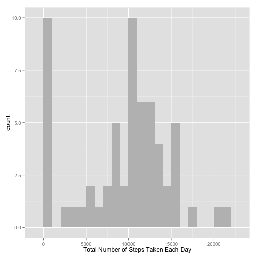
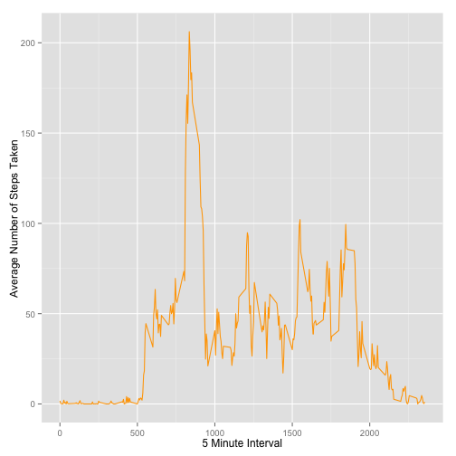
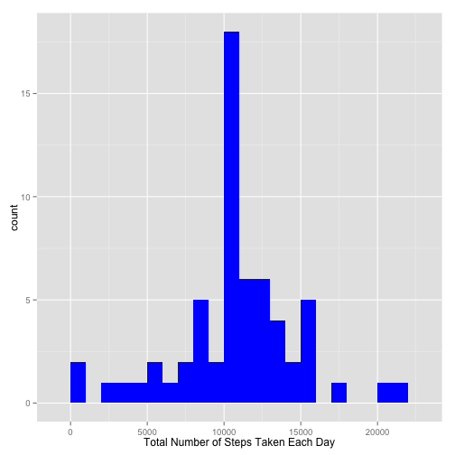
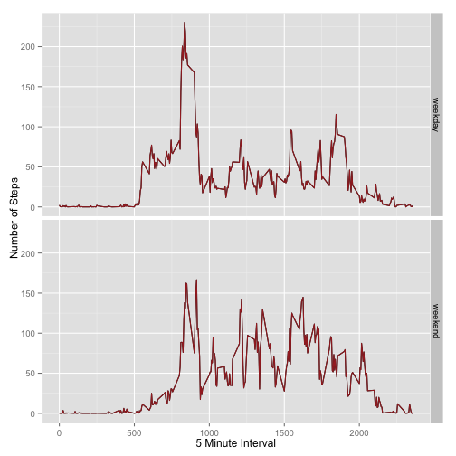

## Loading and Pre-processing the Data
#### 1. Load the data (i.e. read.csv())
#### 2. Process/transform the data (if necessary) into a format suitable for your analysis

```r
setwd("~/RepData_PeerAssessment1")
unzip("activity.zip")
predata<-read.csv("activity.csv",header = TRUE,sep = ",")
```


## What is mean total number of steps taken per day?
#### 1. Calculate the total number of steps taken per day
#### 2. Make a histogram of the total number of steps taken each day


```r
library(ggplot2)
total_steps <- tapply(predata$steps, predata$date, FUN=sum, na.rm=TRUE)
qplot(total_steps, binwidth=1000, fill=I("grey"), xlab="Total Number of Steps Taken Each Day")
```

 

#### 3. Calculate and report the mean and median of the total number of steps taken per day

```r
s_mean<-mean(total_steps, na.rm=TRUE)
s_median<-median(total_steps, na.rm=TRUE)
```

The mean of the total number of steps taken per day is **9354.2295082**

The median of the total number of steps taken per day is **10395**


## What is the average daily activity pattern?
#### 1. Make a time series plot (i.e. type = "l") of the 5-minute interval (x-axis) and the average number of steps taken, averaged across all days (y-axis)


```r
averageSteps <- aggregate(x=list(steps=predata$steps), by=list(interval=predata$interval), FUN=mean, na.rm=TRUE)
ggplot(data=averageSteps, aes(x=interval, y=steps)) + geom_line(colour="orange", size=0.5) + xlab("5 Minute Interval") + ylab("Average Number of Steps Taken")
```

 


#### 2. Which 5-minute interval, on average across all the days in the dataset, contains the maximum number of steps?

```r
averageSteps[which.max(averageSteps$steps),]
```

```
##     interval    steps
## 104      835 206.1698
```


## Imputing missing values
#### 1. Calculate and report the total number of missing values in the dataset (i.e. the total number of rows with NAs)


```r
missingValues <- is.na(predata$steps)
table(missingValues)
```

```
## missingValues
## FALSE  TRUE 
## 15264  2304
```

#### 2. Devise a strategy for filling in all of the missing values in the dataset. The strategy does not need to be sophisticated. For example, you could use the mean/median for that day, or the mean for that 5-minute interval, etc.


```r
  fillna_value <- function(steps, interval) {
    dataNA <- NA
      if (!is.na(steps))
        dataNA <- c(steps)
      else
        dataNA <- (averageSteps[averageSteps$interval==interval, "steps"])
      
  return(dataNA)
}
```

#### 3. Create a new dataset that is equal to the original dataset but with the missing data filled in.


```r
all_data <- predata
all_data$steps <- mapply(fillna_value, all_data$steps, all_data$interval)
```

#### 4. Make a histogram of the total number of steps taken each day and Calculate and report the mean and median total number of steps taken per day.


```r
total_steps <- tapply(all_data$steps, all_data$date, FUN=sum)
qplot(total_steps, binwidth=1000, fill=I("blue"), xlab="Total Number of Steps Taken Each Day")
```

 

```r
mean(total_steps)
```

```
## [1] 10766.19
```

```r
median(total_steps)
```

```
## [1] 10766.19
```

Do these values differ from the estimates from the first part of the assignment? **Taking a difference of mean and median respectively  *(-1411.959171* , *-371.1886792)*, the values deviate slightly**.

What is the impact of imputing missing data on the estimates of the total daily number of steps? **The maximum total daily number of steps moved from about *10* to over *17.5* comparing both plots**.


## Are there differences in activity patterns between weekdays and weekends?

#### 1.Create a new factor variable in the dataset with two levels ??? ???weekday??? and ???weekend??? indicating whether a given date is a weekday or weekend day.

```r
    toweek <- function(date) {
      day <- weekdays(date)
      if (day %in% c("Monday", "Tuesday", "Wednesday", "Thursday", "Friday"))
        return("weekday")
      else if (day %in% c("Saturday", "Sunday"))
        return("weekend")
      else
        stop("invalid date")
    }
    all_data$date <- as.Date(all_data$date)
    all_data$day <- sapply(all_data$date, FUN=toweek)
```

#### 2. Make a panel plot containing a time series plot (i.e. type = "l") of the 5-minute interval (x-axis) and the average number of steps taken, averaged across all weekday days or weekend days (y-axis).

```r
  averages <- aggregate(steps ~ interval + day, data=all_data, mean) 
  
  ggplot(averages, aes(interval, steps)) + geom_line() + facet_grid(day ~ .) + xlab("5 Minute Interval") + ylab("Number of Steps") + geom_line(colour="brown", size=0.5)
```

 
